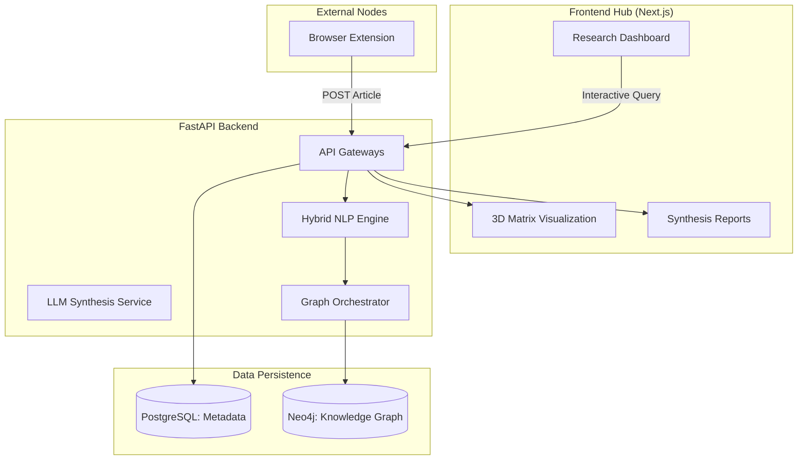
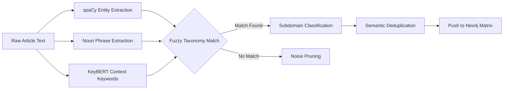
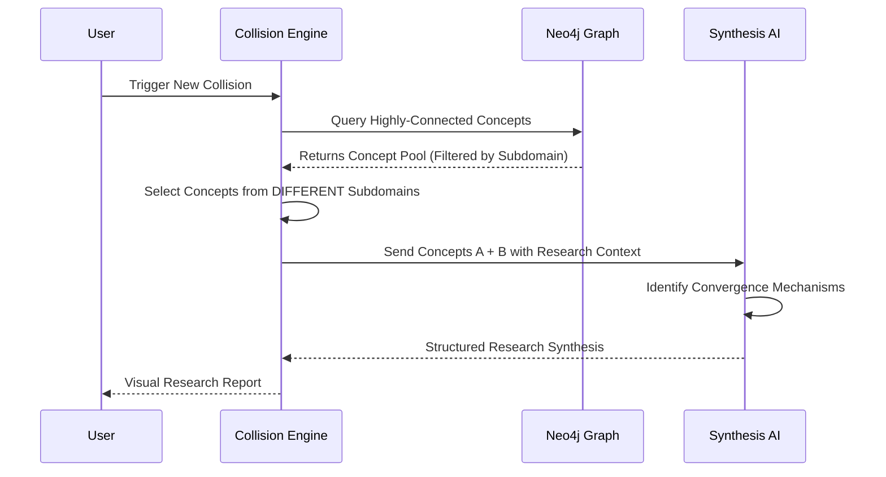
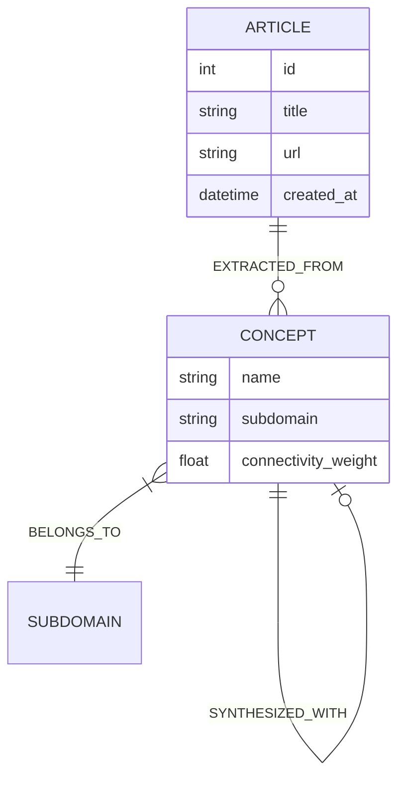

# 🧠 Idea Collision Generator (ICD)

[](https://opensource.org/licenses/MIT)
[](https://www.python.org/downloads/)
[](https://nextjs.org/)
[](https://fastapi.tiangolo.com/)

An advanced AI research engine designed to synthesize interdisciplinary breakthroughs by colliding concepts across specialized **Technology Subdomains**. By utilizing a hybrid NLP extraction pipeline and a subdomain-aware knowledge graph, ICD discovers non-obvious technical convergences.

---

## 🏗️ Core Architecture & Logic

### 1. Unified Tech Taxonomy
The system is specialized for the **Technology** domain, utilizing a centralized 8-subdomain taxonomy to ensure high-precision classification:
- **Artificial Intelligence** (LLMs, Neural Nets, Computer Vision)
- **Data Science & Analytics** (Big Data, Predictive Modeling)
- **Software Engineering** (System Design, DevOps, APIs)
- **Cybersecurity** (Cryptography, Threat Detection)
- **Networking & Cloud** (6G, Edge Computing, Virtualization)
- **Hardware & Robotics** (Embedded Systems, Sensors, Automation)
- **Human-Computer Interaction** (AR/VR, UX Research)
- **Emerging Technologies** (Quantum Computing, Nanotech)

### 2. Hybrid NLP Extraction Pipeline
ICD uses a 7-step hybrid pipeline to transform raw text into a structured concept map:
1.  **Entity Recognition (spaCy)**: Identifies standard technology entities and organizations.
2.  **Noun Phrase Extraction**: Captures complex technical terms (e.g., "Transformer-based architectures").
3.  **BERT-based KeyBERT**: Uses deep learning to extract high-context keywords that traditional matchers miss.
4.  **Fuzzy Taxonomy Matching**: Cross-references extracted terms against the centralized subdomain keyword bank.
5.  **Relevance Filtering**: Automatically prunes non-technical noise (dates, people, generic terms).
6.  **Subdomain Assignment**: Categorizes concepts based on semantic proximity to the 8 core tech fields.
7.  **Deduplication**: Merges variations of the same concept (e.g., "AI" vs "Artificial Intelligence").

### 3. Cross-Subdomain Collision Engine
The "Collision" logic is engineered to maximize **interdisciplinary innovation**:
- **Selection Algorithm**: Instead of random selection, the engine prioritizes concepts from **different subdomains** (e.g., colliding *Cybersecurity* with *HCI*).
- **Relational Weights**: Concepts with higher connectivity in the Knowledge Graph are given priority, but "fringe" concepts are sometimes injected to foster "Black Swan" ideas.
- **Synthesis Logic**: Generates an **Executive Summary**, **Technical Mechanism**, **Market Validity**, and **Implementation Challenges** for every collision.

### 4. Subdomain-Aware Knowledge Graph (Neo4j)
Data is stored in Neo4j with a rich property graph schema:
- **Nodes**: `Article` and `Concept`.
- **Properties**: Concepts carry a `subdomain` property, allowing for complex queries that isolate specific technical fields.
- **Relationships**: `ExtractedFrom` connects concepts to their source articles, enabling "Targeted Synthesis" from specific research pools.

---

## 🧬 Architectural Diagrams

### 1. High-Level Core Architecture
ICD follows a modern distributed architecture, utilizing both relational and graph databases to handle multi-modal data structures.



### 2. Hybrid NLP Extraction Pipeline
The core "intelligence" of the system follows a 7-step hybrid protocol combining rule-based and BERT-driven extraction.



### 3. Idea Collision Synthesis Logic
Our synthesis engine explicitly forces "Domain Fracturing" by selecting disparate technical nodes.



### 4. Knowledge Graph Schema
Mapping the interdisciplinary links between source articles and their derived technical concepts.



---

## 🛠️ Technology Stack

### Backend Logic & AI
- **FastAPI**: Asynchronous high-performance web framework.
- **spaCy (NLP)**: Primary entity and noun-phrase extraction engine.
- **KeyBERT**: BERT-based keyword extraction for context-aware discovery.
- **Sentence-Transformers**: Used for semantic subdomain classification.
- **Neo4j**: Graph database for mapping multi-dimensional relationships.
- **Gemini 1.5 / GPT-4**: Large Language Models for deep-dive research synthesis.

### Frontend (Research Hub)
- **Next.js & React**: Modern component-based architecture for the research dashboard.
- **Three.js (react-force-graph-3d)**: High-performance 3D visualization of the concept matrix.
- **Tailwind CSS**: Custom "Research Hub" design system focused on readability and data density.

---

## 🚀 Technical Workflow

### 1. Ingestion & Graph Seeding
When an article is captured, the backend performs synchronous NLP extraction:
```python
# The pipeline filters out generic terms and classifies concepts into subdomains
extracted_data = nlp.extract_concepts(article_text)
# Concepts are stored in Neo4j with their subdomain metadata
graph.add_concepts(article_id, extracted_data["concepts_with_metadata"])
```

### 2. Automated Synthesis
The synthesis engine selects two concepts from different subdomains and prompts the LLM to find a convergence:
- **Objective**: Create a "Force Multiplier" effect where Subdomain A improves Subdomain B.
- **Output**: A structured research report with feasibility and market potential scores.

### 3. Interactive Matrix Exploration
Users explore the graph in a dedicated "Matrix View" that supports:
- **Color-coded Nodes**: Instant visual identification of technical domains.
- **Connectivity Weighting**: Nodes grow larger as they become central to the research pool.
- **Pathfinding**: Highlighting hidden links between disparate technical topics.

---

## 📁 Repository Structure

- `backend/app/services/nlp.py`: The heart of the extraction logic and taxonomy mapping.
- `backend/app/services/graph.py`: Manages the Neo4j schema and cross-subdomain queries.
- `backend/app/services/llm.py`: Handles structured research report generation and scoring.
- `extension/`: Chrome extension for high-fidelity article scraping.
- `frontend/app/graph/`: Interactive 3D matrix visualization integration.

---

## 📝 License
MIT License - Developed for the VJTI Final Year Project (FYP).

**Built for researchers aiming to push the boundaries of technical convergence.**
